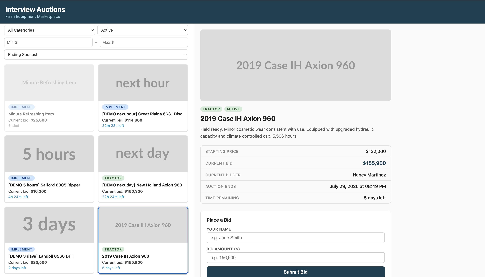
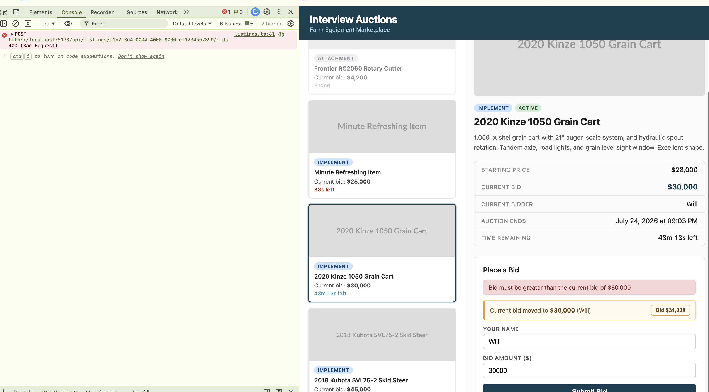

# Interview Auctions

A farm equipment auction platform. React + Vite frontend, Express + SQLite API.



Live countdowns on every card, with the format following how much time is left:
`22m 28s left`, `4h 24m left`, `22h 24m left`, `2 days left`. The first card is
the self-refreshing demo lot, caught here between cycles — greyed out and
reading "Ended" a few seconds before it reopens. See
[Development fixtures](#development-fixtures).

---

## Quick start

```bash
make install
make demo
```

`make demo` rebuilds the database from the migrations, loads 300 listings with
bid histories, and runs the API and frontend together. Ctrl-C stops both.

Then open **http://localhost:5173**.

`make` on its own lists every target.

| | |
|---|---|
| `make install` | dependencies for both packages |
| `make demo` | reset, seed 300 listings, run everything |
| `make dev` | run both halves without reseeding |
| `make api` / `make web` | one half only |
| `make seed` | reload the 300-listing fixture |
| `make reset` | delete the database so it rebuilds from migrations |
| `make test` | every test, both packages |
| `make test-server` / `make test-web` | one suite |
| `make coverage` | tests plus a combined coverage table |
| `make lint` | Biome across the repo |
| `make stop` | kill anything left on ports 3001 / 5173 |
| `make clean` | database, `dist/`, coverage reports |

`make demo` is the one worth using for a first look. In order it:

1. deletes `auction.db`, so the next start rebuilds the schema from the
   migrations rather than from whatever happened to be lying around
2. runs the seed script — 300 listings, ~1,250 bids, nine fixed `[DEMO …]` lots
3. starts the API on 3001 and the frontend on 5173 in one terminal, with a
   `trap` so Ctrl-C stops both instead of orphaning one

There are two reasons it's a Makefile rather than more npm scripts. The project
is two packages with separate `package.json` files, so anything spanning both
has to live above them. And the default `node` on a machine is often too old for
Vite 7 — every target sources nvm and honours the committed `.nvmrc`, so `make
demo` works without anyone first working out why `npm run dev` didn't.

### What to look at first

A listing called **Minute Refreshing Item** reopens about once a minute, so the
countdown's final seconds and the live switch to its ended state are always a
few seconds away rather than something to wait for.

Searching `DEMO` surfaces nine fixed listings, one per countdown band — three
days out, hours, minutes, 45 seconds, already ended, and one past its end time
that nothing has swept yet.

Open the app in two browser windows and place a bid in one: the other updates
without a refresh.

---

## Running it by hand

Two terminals, without make. The API needs to be running before the frontend is
useful.

**Terminal 1 — API** (http://localhost:3001)

```bash
cd server/typescript
npm install
npm run dev
```

First run creates the database, applies migrations, and seeds eight listings:

```
migrated: 001_initial.sql
migrated: 002_bid_history.sql
seeded 8 listings
Server running at http://localhost:3001
```

**Terminal 2 — frontend** (http://localhost:5173)

```bash
npm install
npm run dev
```

Open **http://localhost:5173**. Vite proxies `/api` to port 3001.

### Node version

Node **20.19+** (Vite 7 requires it). An `.nvmrc` is committed:

```bash
nvm use
```

### Tests

```bash
make test        # both packages
make coverage    # with a combined summary
```

301 tests — 180 against the API, 121 against the frontend.

    Frontend    93.28% statements   95.75% lines
    API         98.29% statements   98.47% lines
    Combined    96.06% statements   97.27% lines

Each API test runs against its own in-memory SQLite database, migrated and
seeded, so they are independent and order-insensitive — and they exercise the
real migrations rather than a schema built some other way.

`make coverage` writes HTML reports to `coverage/` and
`server/typescript/coverage/`, and prints one table covering both packages,
since a per-package number only ever tells half the story.

---

## Which backend

The project shipped with two equivalent backends and asked for one to be
chosen. **This work uses TypeScript/Express** (`server/typescript`).

`server/python` is left exactly as delivered — it still has the original
bidding bug and none of the features below. Leaving it untouched seemed better
than half-migrating it: a backend carrying the bug fix but not bid history or
pagination is more confusing than one that's obviously untouched.

---

## Database

SQLite, via `better-sqlite3`. The file lives at
`server/typescript/data/auction.db` and is gitignored — it's rebuilt from the
migrations plus `data/listings.json` on first boot.

To start over, delete it and restart the server:

```bash
rm server/typescript/data/auction.db*
npm run dev
```

### Migrations

Hand-rolled, in `server/typescript/migrations/`. Numbered `.sql` files applied
in filename order, each inside a transaction, with applied filenames recorded
in a `schema_migrations` table.

```
001_initial.sql                    listings
002_bid_history.sql                bids
003_listing_images.sql             listing photos, stored as blobs
004_listings_default_view_index.sql indexes for the landing page
```

It's about forty lines in `db.ts`. Knex or Drizzle would both do this, but the
behaviour that matters — ordering, atomicity, what counts as already applied —
is short enough to state directly, and a dependency in a codebase this size is
something you have to justify.

### Indexes

The landing page — active listings, soonest to close — is the query almost
every visit runs, so it gets an index shaped for it:

```sql
CREATE INDEX listings_status_ends_at_idx ON listings (status, ends_at, id);
```

Filter column first, then sort columns. Before it, SQLite filtered on `status`
and sorted the survivors:

```
SEARCH listings USING INDEX listings_status_idx (status=?)
USE TEMP B-TREE FOR ORDER BY        <-- sorts every active listing
```

That sort grows with the number of active auctions, not the size of the page,
so it's invisible at 300 rows and the first thing to hurt at 300,000. With the
composite index the sort step is gone, and the pager's `COUNT` becomes a
covering index scan that never touches the table. Measured at 20,000 rows with
statistics gathered: **0.04ms**.

`id` is in there because the query's tiebreak is `(ends_at, id)` — without it
SQLite still needs a sort to settle rows sharing an end time. The same applies
one level down, so `listings_ends_at_idx` was rebuilt as `(ends_at, id)` for
the "any status, ending soonest" view. `listings_status_idx` was dropped:
`status` leads the new index, so it was a second index to write on every insert
for no read benefit.

**To add a migration:** create the next numbered file. Don't edit one that has
already run — "applied" is tracked by filename with no checksum, so editing an
applied migration silently does nothing on machines that already have it.

**Deliberately not there yet: a `users` table.** `bidder` is free text typed
into a form with no authentication behind it, so a users table today would hold
unverified names and buy a join. When auth arrives it's migration 003 — create
`users`, backfill from distinct bidder values, add `bids.user_id` as a foreign
key, drop the text column.

Migrations currently run at boot. That's fine at this size and wrong in
production — several instances starting at once all race to migrate, and a
failed migration takes the service down with it. It belongs in a deploy step
that runs once.

---

## API

| Method | Path | |
|---|---|---|
| `GET` | `/api/listings` | paginated, filterable, sortable |
| `POST` | `/api/listings` | create — JSON or multipart with a photo |
| `GET` | `/api/listings/:id/image` | the listing's photo |
| `GET` | `/api/listings/:id` | one listing |
| `POST` | `/api/listings/:id/bids` | place a bid |
| `GET` | `/api/listings/:id/bids` | bid history, newest first |
| `GET` | `/api/events` | SSE stream of bid / closed / updated events |

### `GET /api/listings`

| Param | | |
|---|---|---|
| `page` | 1-based | default `1` |
| `pageSize` | | default `20`, max `100` |
| `category` | `tractor` `combine` `implement` `attachment` | |
| `status` | `active` `closed` `pending` | |
| `q` | substring match on title + description | case-insensitive |
| `minPrice` / `maxPrice` | inclusive bounds on `currentBid` | |
| `sort` | `endsAt` `currentBid` `title` | default `endsAt` |
| `order` | `asc` `desc` | default `asc` |

```json
{
  "data": [ … ],
  "pagination": {
    "page": 1, "pageSize": 20,
    "totalItems": 8, "totalPages": 1, "hasMore": false
  }
}
```

Invalid parameters return `400` naming the parameter rather than being
coerced — `page=abc` is a caller bug, and quietly serving page 1 hides it.

---

## Creating a listing

`POST /api/listings` takes JSON, or `multipart/form-data` when a photo comes
with it.

| Field | | |
|---|---|---|
| `title` | required | up to 200 characters |
| `description` | optional | up to 2,000 characters |
| `category` | optional | `tractor` `combine` `implement` `attachment`, default `implement` |
| `startingPrice` | optional | the reserve. Bidding opens here, so the first bid must beat it. `0` means no reserve |
| `endsAt` | optional | must be in the future and within a year. Defaults to a week out |
| `image` | optional | JPEG, PNG, WebP or GIF, up to 2MB |

**`id`, `currentBid`, `currentBidder` and `status` are the server's.** Values
sent for them are ignored rather than rejected — a client sending extra keys
isn't broken, it just doesn't get to pick. The reason is the obvious one: a
caller who could set their own `id` could overwrite an existing listing, and
one who could set `currentBidder` could open a lot already won.

`currentBid` starts at `startingPrice`, which is what makes the reserve
meaningful without a second column to keep in step.

### Photos

Stored in the database as a blob, in `listing_images`, and served from
`GET /api/listings/:id/image`.

**In the database rather than on disk** because local disk breaks the moment
there's more than one process — a second instance serves 404s for anything the
first one accepted. Keeping the bytes here means the database file is the whole
state, which is also what makes `make reset` actually reset. SQLite is well
suited to this at these sizes; its own guidance puts blob reads ahead of
filesystem reads below roughly 100KB and competitive to about a megabyte, and
the 2MB cap makes the tail of that range the worst case rather than the norm.
Past one machine the answer is object storage with a presigned URL, which is a
different shape rather than a bigger version of this.

**In its own table, not a column on `listings`**, because every list query is
`SELECT * FROM listings` and an inline blob would drag megabytes through memory
to render six cards. A test asserts listing payloads carry the URL and never
the bytes.

**Multipart rather than base64 in JSON**: base64 avoids the dependency but
inflates the payload by a third and has to be fully buffered before anything
can validate it. multer enforces the cap while receiving, so an oversized
upload is cut off mid-flight.

The stored filename is never the client's — the URL is derived from the listing
id, so `../../etc/passwd.png` has nowhere to go. Type checking is an allowlist,
and SVG is deliberately not on it: an image to a browser, a script host to an
attacker.

The listing and its photo are written in one transaction. A listing whose
`imageUrl` pointed at an image row that failed to insert would 404 its own
photo forever, with nothing to notice or repair it.

---

## Realtime

`GET /api/events` is a Server-Sent Events stream. Three event types:

| | |
|---|---|
| `bid` | a bid was accepted — carries the new price and bidder |
| `closed` | the expiry sweep closed an auction |
| `updated` | anything else about a listing changed |

**SSE rather than WebSockets** because every message travels server → client.
Bids already arrive over `POST`, so a client → server channel would be built and
never used, and bidirectionality is WebSocket's entire justification. SSE also
reconnects on its own, where WebSocket reconnection is code you write and then
have to test.

The counter-argument, for completeness: SSE over HTTP/1.1 is subject to the
browser's ~6-connections-per-origin cap. The app opens one, so it isn't a
constraint here, and under HTTP/2 it multiplexes and the objection disappears.

**One channel, not one per listing.** "All auctions update with the real time
highest bidder" means clients need events for lots they aren't looking at, so
filtering server-side would defeat the requirement. Subscribers apply only the
events matching listings they hold. That is also the scaling limit worth
naming: every bid reaches every connection, and the next step would be sharding
by listing or a fan-out service between the API and the clients.

**One connection at the app root**, not one per component. A card owning its own
`EventSource` would open six on a page of six and exhaust the connection pool.
Events land in `setState`; React's own diffing decides which cards re-render.

Events sent while a client is disconnected are gone. Rather than server-side
replay keyed on `Last-Event-ID`, the client refetches when the stream reopens —
one request, correct regardless of how long the gap was.

### Expiry

A sweep runs every few seconds, closing anything past its end time and
publishing `closed`. It's a single indexed `UPDATE ... RETURNING`, not a scan or
a per-row loop, which matters because better-sqlite3 is synchronous and the
statement occupies the event loop for its duration.

The sweep does **not** replace the `endsAt` check inside the bid transaction. A
sweep has an interval, and that interval is exactly the window in which a late
bid would be accepted. The sweep is for tidiness and queryability; the
comparison in the transaction is what's load-bearing.

### The countdown

Ticks on the client, on a clock corrected against the server once at startup
from a response's `Date` header. Streaming countdown values would spend a
persistent connection delivering a number the client can compute from `endsAt`,
and would freeze when the connection dropped.

One interval for the whole page, shared through context — not one per card,
which is one cleanup path per card to get wrong.

Precision follows urgency: `3 days left` → `1d 14h left` → `6h 21m left` →
`4m 32s left` → `45s left`, with the final minute styled as urgent. Rendering
seconds a week out is noise pretending to be information.

---

## Telemetry

Structured JSON logs on stdout, one object per line. Metrics go to stdout too,
unless `DD_API_KEY` is set, in which case they're batched and shipped to
Datadog's series API.

| Variable | |
|---|---|
| `DD_API_KEY` | enables the Datadog sink |
| `DD_SITE` | intake host, default `datadoghq.com` |
| `DD_ENV` | tagged on everything, default `development` |
| `DD_SERVICE` | default `interview-auctions-api` |
| `LOG_LEVEL` | `debug` `info` `warn` `error`, default `info` |

What's emitted:

```
http.request        timing + count, tagged method / route / status
bid.accepted        count, plus bid.amount as a gauge
bid.rejected        count, tagged with the reason
auction.closed      count, from the expiry sweep
expiry.sweep        timing, every pass
sse.subscribers     gauge, on connect and disconnect
```

---

## Development fixtures

**`make seed`** generates 300 listings with roughly 1,250 bids across ~690
distinct bidders. Deterministic, from a seeded PRNG rather than `Math.random()`,
so "it breaks on page 7" is reproducible by someone else. Idempotent — it clears
before seeding.

```bash
make seed                          # 300 listings
cd server/typescript
npm run seed:demo -- 500           # or any count
```

### Minute Refreshing Item

A single listing that reopens on a loop. It exists purely so the minute-scale
countdown and the expired-auction state are easy to see without waiting around
for a real lot to close. Started by the server itself (`demo-refresher.ts`), so
there's no separate process to remember to run. `DEMO_REFRESH=off` turns it off.

```
t+0s    ends_at = now + 60s, status = active, bids cleared, price reset
        an `updated` event goes out to every connected browser
        the card counts down, turning red inside the last minute
t+60s   the countdown reaches zero and the card flips to Ended on its own
        the expiry sweep notices within a few seconds, sets status = closed,
        and publishes `closed`
t+80s   the cycle repeats
```

---

## The bidding bugs

### 1. The comparison was backwards

`server/typescript/app.ts`

```ts
if (bid.amount >= listing.currentBid) {   // reject
```

One operator, two opposite failures. Bid $200,000 on a $185,000 tractor and you
get told your bid has to be higher than $185,000. Bid $100 and you win it.

The fix is `<=`, not `<`. A bid equal to the current one should also be
rejected, and the error message already promised "greater than the current bid",
so `<=` is what makes the message true. `<` would pass a naive "higher bid wins"
test and quietly allow ties — the kind of thing that surfaces during a dispute
rather than during development.

### 2. Reading `e.currentTarget` after an `await`

`src/components/BidForm.tsx`, and the same thing in `CreateListingForm.tsx`

```ts
const updated = await placeBid(...);
onBidSuccess(updated);
e.currentTarget.reset();   // currentTarget is null by now
```

React sets `currentTarget` back to null once the handler's synchronous phase
ends. The await puts this line well past that point, so it throws — on a
*successful* bid. That's the confusing part: the bid goes through, the server
has it, and the UI still reports an error and won't clear the form.



The screenshot is the bug's downstream effect, reproduced by reverting the fix.
The bid of $30,000 went through — the panel shows it as the current bid, under
the right bidder. But `reset()` threw, so the form kept its values, and pressing
Submit again re-sent the same amount. The server correctly refused it for not
being greater than the current bid, which is the `400` in the console and the
red banner.

Worth noting where the original error *doesn't* appear: not in the console. The
`reset()` call sits inside the `try`, so the `TypeError` is caught by the same
handler meant for failed bids and rendered as though the bid itself had failed.
A successful bid reporting a null-reference error is a confusing thing to debug
from the outside, which is most of why this one is worth writing up.

The fix is to grab the element before the await:

```ts
const form = e.currentTarget;
```

The alternative is a `useRef` on the form. Same effect, one more moving part, no
benefit here. I did fix `CreateListingForm` as well even though nothing was
visibly broken there — it's the identical bug, just not exercised as often, and
leaving a known one in place because it hasn't bitten yet seemed like the wrong
call.

### 3. Bids on auctions that had already closed

Not in the brief's repro steps. I found it while clicking through the seeded
listings: the endpoint checked `status !== "active"` and never looked at
`endsAt`, so a lot that closed in April was still taking bids in July. A bid of
$999,999 on it was accepted.

I wrote the test first for this one, watched it fail with "expected 400, got
201", then added the check inside the bid transaction next to the amount
comparison.

Two things I considered instead:

- **Sweep statuses on a timer and keep trusting `status`.** A sweep has an
  interval, and that interval is precisely the window where a late bid gets
  accepted. It closes most of the hole and leaves the interesting part open.
- **Derive it only on the client.** Cheaper, and completely useless — anyone
  with curl still wins the auction.

So I did both layers, with different jobs. The `endsAt` check in the transaction
is what makes it correct. The sweep (added later with the realtime work) is what
makes the stored data honest so `?status=active` means something.

### 4. The seed data had gone stale

Every `endsAt` in the fixture was April 2026. It was July. So all eight listings
had closed before anyone ran the project, and a countdown had nothing to count.

Not a code bug, but it blocks two of the tasks, and it's the reason the fixture
now stores `endsInHours` and resolves it at seed time. An absolute date in a
fixture is stale the moment it ships.

---

## Beyond the brief

Things nobody asked for. Listed separately so it's clear what was scope and what
wasn't.

**Tests.** The brief says they're not required. There were none, and after the
first bug I wanted a way to prove the fix stuck. 339 now, ~96% combined. The
frontend had no test runner at all, so that's Vitest + jsdom + Testing Library
added from scratch. The clearest payoff: reverting the `>=` operator fails 13
tests, so the original bug can't come back quietly.

**SQLite and migrations.** The app was in-memory and everything vanished on
restart. Four numbered migrations behind a ~40-line runner, rather than Knex or
Drizzle, because every dependency is one more thing to defend and this is short
enough to read in a sitting. It also bought the bid transaction, which is
what makes concurrent bidding actually safe rather than accidentally safe.

**Price sorting and filters.** `sort` and `order` weren't asked for — the brief
says pagination should compose with sorting "already in place", and there wasn't
any. Sorting by price and end date is what an auction site needs. The price
range filter shipped in the API before the UI exposed it, which was an oversight
on my part rather than a plan.

**Structured logging and telemetry.** There was no logging at all, not even
request logs. JSON lines to stdout, and metrics to Datadog when `DD_API_KEY` is
set. The part I'd defend hardest is the cardinality discipline: routes tagged by
pattern rather than by id, bid amounts as a gauge rather than a tag, bidder
names redacted.

**Seeding.** Eight listings can't demonstrate pagination. 300 generated ones
with real bid histories can, and it's deterministic so a bug on page 7 is
reproducible by someone else.

**The self-refreshing listing.** Watching a countdown hit zero meant reseeding
and waiting. Now one lot reopens every minute or so. It turned out to be more
useful than intended — it exercises the sweeper, the refresher and SSE all at
once, so if realtime breaks, that card visibly stops moving.

**A Makefile.** `make demo` is one command that resets, seeds and runs both
halves. Mostly so nobody reviewing this has to read setup instructions to see it
working.

The assigned tasks landed inside the brief's 1–2 hours; the commit timestamps
show the shape of it. Everything after that is the tooling above, and I kept
going because each piece paid for itself. Migrations meant I stopped
hand-editing fixture data. The seed script meant pagination had something real
to page through. The self-refreshing listing meant I could watch a countdown
expire without waiting a minute each time.

The tests are the clearest case. Writing them up front caught the expiry bug,
the stale-status bug on the cards, and a `.gitignore` pattern that was silently
committing the database — each of which would have taken longer to find by
clicking around.

---

## Notes on the work

### The response shape of `GET /api/listings` is a breaking change

It used to return a bare array. Anything doing `listings.map(...)` on the
response breaks.

With real clients I wouldn't do this in place — either `/api/v2/listings` with
v1 deprecated on a published timeline, or return the envelope only when
pagination params are present. I took the break because this app has exactly
one consumer, it lives in this repo, and it's updated in the same commit. The
dual-shape option in particular buys compatibility at the cost of an endpoint
whose return type depends on its input, which is worse to consume and worse to
type.

### Sort ordering is total

Every sort breaks ties on `id`. Without that, two rows comparing equal can come
back in a different order between requests, and a client paging through sees
one row twice while missing another. That's the pagination bug that only shows
up once there's real data.

### `currentBid` is denormalised

`listings.current_bid` and `current_bidder` are a cached projection of the
newest bid. They predate the `bids` table and the API exposes them, so they
stayed — written in the same transaction as the bid that changes them. The
alternative is deriving them from history on every read: always correct, more
work per request. A test asserts the two agree so they can't drift silently.

### Bids are placed in a transaction

Read-validate-write is atomic. Otherwise two bids arriving together both read
the same `current_bid`, both conclude they win, and the second overwrites the
first — a lost update. The transaction is what makes "must beat the current
bid" hold under load rather than only when requests happen to arrive one at a
time.

### Empty and missing are different

`GET /api/listings/:id/bids` returns `200 []` for a real listing nobody has bid
on, and `404` for a listing that doesn't exist. Returning `[]` for both tells
the client nothing about which happened.

---

## Troubleshooting

**`better-sqlite3` fails to build with `fatal error: 'climits' file not found`**

This should fix itself. `npm install` in `server/typescript` runs a postinstall
check that loads the native binding and, if it didn't build, rebuilds it with
the macOS SDK's C++ headers on the include path:

```
better-sqlite3 did not build. Attempting to repair.
  using C++ headers from /Library/.../MacOSX.sdk/usr/include/c++/v1
  repaired — native SQLite binding is working.
```

That's why `better-sqlite3` sits in `optionalDependencies` rather than
`dependencies`: npm aborts the whole install when a required dependency's build
fails, which would kill the process before the repair could run.

If it still fails, from `server/typescript`:

```bash
export CPLUS_INCLUDE_PATH="$(xcrun --sdk macosx --show-sdk-path)/usr/include/c++/v1"
npm rebuild better-sqlite3 --build-from-source
```

and if that fails too, the Command Line Tools are probably incomplete —
`xcode-select --install`.

**Why this happens at all:** prebuilt binaries cover most platforms, but not
x64 macOS on Node 20, so there it compiles from source. Recent Command Line
Tools don't put the C++ standard headers on the default include path. Apple
Silicon gets a prebuilt binary and never sees it.

**Port already in use** — the API expects 3001 and the frontend 5173. Change
the proxy target in `vite.config.ts` if you move the API.
